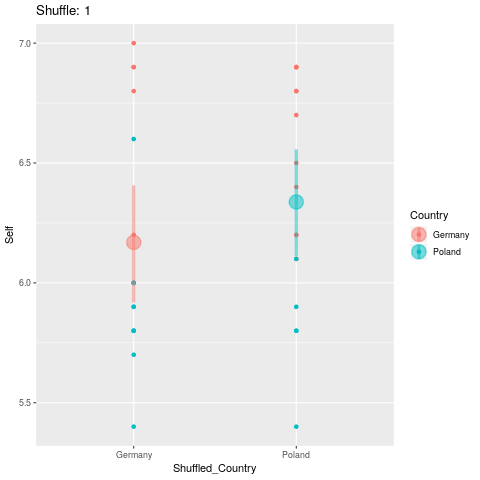

```{r, include=FALSE}
# Load Libraries
library(openxlsx)
library(Hmisc)
library(mosaic)
library(knitr)

######################################################
### Start: Data preprocessing
######################################################

# Download file (only once)
# url <- "https://www.oecdregionalwellbeing.org/assets/downloads/OECD-Regional-Well-Being-Data-File.xlsx"
# download.file(url = url, destfile = "OECD.xlsx")

# Read data into R
oecd <-read.xlsx("OECD.xlsx", 
                 startRow = 9, colNames = FALSE,
                 sheet = 4, rows = 9:410, cols=2:17)


colnames(oecd)<-c("Country","Region","Code","Labour","Employment","Unemployment", "Household",
                  "Homicide","Mortality","Life","Air","Voter","Broadband","Number","Perceived",
                  "Self")

oecd_numvars <- c("Labour","Employment","Unemployment", "Household",
                  "Homicide","Mortality","Life","Air","Voter","Broadband","Number","Perceived",
                  "Self")

oecd_labels <- c("Country","Region","Code","Labour force with at least secondary education", 
                 "Employment rate","Unemployment rate", "Household Household disposable income per capita", 
                 "Homicide rate","Mortality rate","Life expectancy","Air pollution","Voter turnout",
                 "Broadbandaccess","Number of rooms per person","Perceived social network support", 
                 "Self assessment of life satisfaction")

# To convert some missing data in Excel sheet

setna <- function(x) replace(x, x=="..", NA)
oecd <- oecd %>%
  mutate_all(setna) %>%
  mutate_at(oecd_numvars, as.numeric)

Countries <- oecd %>%
  select(Country) %>%
  unique() %>%
  pull()

Variables <- oecd_numvars

#################################################
# Selection of Countries and Variable of Interest
my_countries <- c("Poland", "Germany")
my_variable <- "Self"

my_data <- oecd %>%
  select("Country", "Region", my_variable) %>%
  filter(Country %in% my_countries)

# Observed Difference
Obs_Diff <- diffmean(Self ~ Country, data = my_data)

#################################################
# Monte Carlo Permutation

# Number of permutations
nperm <- 100
set.seed(1896)

shuffled_data <- list()

for(i in 1:nperm)
  {
  # Shuffle Country
  my_shuffle <- my_data %>%
    mutate(Shuffled_Country = shuffle(Country)) %>%
    mutate(Shuffle = i)
  
  # Add data frame
  shuffled_data <- shuffled_data %>%
    bind_rows(my_shuffle)
  }

# Calculate difference in means
Shuffled_Diffs <- shuffled_data %>%
  group_by(Shuffle) %>%
  summarise(Diff_Mean = diffmean(Self ~ Shuffled_Country)) %>%
  ungroup()

```

### Data

Source: [https://www.oecdregionalwellbeing.org/](https://www.oecdregionalwellbeing.org/)

### Observed Difference

```{r, echo=FALSE, fig.align="center", out.width="60%"}
p1 <- ggplot(my_data, aes(x = Country, y = Self, color = Country)) +
      geom_point() +
      stat_summary(fun.data = "mean_cl_boot", aes(colour = Country), size = 1.5, alpha = 0.5) +
      labs(title = paste("Observed difference in means:", Obs_Diff),
           y="Self")
p1
```

### Permuted differences plot

```{r, eval=FALSE, echo=FALSE}
library(gganimate)
p <- ggplot(shuffled_data, aes(x = Shuffled_Country, y = Self, color = Country)) +
  geom_point() +
  stat_summary(fun.data = "mean_cl_boot", aes(colour = Shuffled_Country), size = 1.5, alpha = 0.5) +
  labs(title = "Shuffle: {closest_state}") +
  transition_states(Shuffle)
anim_save("permutation.gif", animate(p))
```

```{r, echo=FALSE, fig.align="center", out.width="60%"}

```

```{r, echo=FALSE, fig.align="center", out.width="60%"}
ggplot(Shuffled_Diffs, aes(x = Shuffle, y = Diff_Mean, color = abs(Diff_Mean) >= abs(Obs_Diff))) +
  geom_point() +
  geom_hline(yintercept = abs(Obs_Diff)) +
  geom_hline(yintercept = -abs(Obs_Diff)) +
  labs(title = paste("Number of permutations with larger difference in means \n than observed:",
                     sum(abs(Shuffled_Diffs$Diff_Mean) >= abs(Obs_Diff)),
                     "\n for countries ", my_countries[1], "and ", my_countries[2]),
       subtitle = paste("Observed difference in means:", Obs_Diff),
       y = paste("Difference in means of Variable:\n ", my_variable)) +
  theme(legend.position = "none")
```

### Permutation Distribution

```{r, echo=FALSE, fig.align="center", out.width="60%"}
ggplot(Shuffled_Diffs, aes(x = Diff_Mean, fill = abs(Diff_Mean) >= abs(Obs_Diff))) +
  geom_histogram(center=0, bins=21) +
  geom_rug() +
  geom_vline(xintercept = Obs_Diff) +
  labs(title = paste("Number of permutations with larger difference in means \n than observed:",
                     sum(abs(Shuffled_Diffs$Diff_Mean) >= abs(Obs_Diff)), " of ", nperm,
                     "\n for countries ",  my_countries[1], "and ",  my_countries[2]),
       x = paste("Difference in means of Variable:\n ", my_variable)) +
  theme(legend.position = "none")
```


