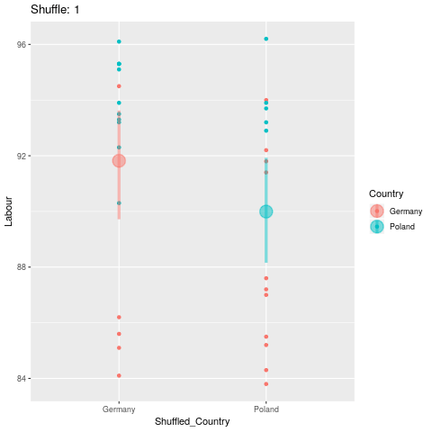

```{r, include=FALSE}
# Load Libraries
library(openxlsx)
library(Hmisc)
library(mosaic)
library(knitr)

######################################################
### Start: Data preprocessing
######################################################

# Download file (only once)
# url <- "https://www.oecdregionalwellbeing.org/assets/downloads/OECD-Regional-Well-Being-Data-File.xlsx"
# download.file(url = url, destfile = "OECD.xlsx")

# Read data into R
oecd <-read.xlsx("OECD.xlsx", 
                 startRow = 9, colNames = FALSE,
                 sheet = 4, rows = 9:410, cols=2:17)


colnames(oecd)<-c("Country","Region","Code","Labour","Employment","Unemployment", "Household",
                  "Homicide","Mortality","Life","Air","Voter","Broadband","Number","Perceived",
                  "Self")

oecd_numvars <- c("Labour","Employment","Unemployment", "Household",
                  "Homicide","Mortality","Life","Air","Voter","Broadband","Number","Perceived",
                  "Self")

oecd_labels <- c("Country","Region","Code","Labour force with at least secondary education", 
                 "Employment rate","Unemployment rate", "Household Household disposable income per capita", 
                 "Homicide rate","Mortality rate","Life expectancy","Air pollution","Voter turnout",
                 "Broadbandaccess","Number of rooms per person","Perceived social network support", 
                 "Self assessment of life satisfaction")

# To convert some missing data in Excel sheet

setna <- function(x) replace(x, x=="..", NA)
oecd <- oecd %>%
  mutate_all(setna) %>%
  mutate_at(oecd_numvars, as.numeric)

Countries <- oecd %>%
  select(Country) %>%
  unique() %>%
  pull()

Variables <- oecd_numvars

#################################################
# Selection of Countries and Variable of Interest
my_countries <- c("Poland", "Germany")
my_variable <- "Labour"

my_data <- oecd %>%
  select("Country", "Region", my_variable) %>%
  filter(Country %in% my_countries)

# Observed Difference
Obs_Diff <- diffmean(Labour ~ Country, data = my_data)

#################################################
# Monte Carlo Permutation

# Number of permutations
nperm <- 100
set.seed(1896)

shuffled_data <- list()

for(i in 1:nperm)
  {
  # Shuffle Country
  my_shuffle <- my_data %>%
    mutate(Shuffled_Country = shuffle(Country)) %>%
    mutate(Shuffle = i)
  
  # Add data frame
  shuffled_data <- shuffled_data %>%
    bind_rows(my_shuffle)
  }

# Calculate difference in means
Shuffled_Diffs <- shuffled_data %>%
  group_by(Shuffle) %>%
  summarise(Diff_Mean = diffmean(Labour ~ Shuffled_Country)) %>%
  ungroup()

```

### Data

OECD Regional Well-Being data (2019) is used here. The data shows how regions perform when it comes to education, environment, safety and other topics important to your well-being. This interactive site allows you to measure well-being in your region and compare it with 402 other OECD regions based on eleven topics central to the quality of our lives.

Source: [https://www.oecdregionalwellbeing.org/](https://www.oecdregionalwellbeing.org/)

-  Labour force with at least secondary education (in \%): `Labour`
-  Employment rate (in \%): `Employment`
-  Unemployment rate (in \%): `Unemployment`
-  Household disposable income per capita (in constant USD PPP): `Household`
-  Homicide rate (per 100000 people): `Homicide`
-  Mortality rate (per 100000 people): `Mortality`
-  Life expectancy (in number of years): `Life`
-  Air pollution (level of PM2.5, in $\mu g/ m^3$): `Air`
-  Voter turnout (in \%): `Voter`
-  Broadband access (in \% of households): `Broadband`
-  Number of rooms per person (rooms per person): `Number`
-  Perceived social network support (in \%): `Perceived`
-  Self assessment of life satisfaction (index 0 to 10): `Self`


### Observed Difference

For the countries `Poland` and `Germany` and the variable `Labour` (Labour force with at least secondary education (in \%)) it turns out that

- $\bar{x}_{\text{Germany}} = `r round(mean(Labour ~ Country, data = my_data)[1],2)`$
- $\bar{x}_{\text{Poland}} = `r round(mean(Labour ~ Country, data = my_data)[2],2)`$

So that 

$$\bar{x}_{\text{Poland}} - \bar{x}_{\text{Germany}} = `r round(mean(Labour ~ Country, data = my_data)[2],2)` - `r round(mean(Labour ~ Country, data = my_data)[1],2)` = `r round(diffmean(Labour ~ Country, data = my_data),2)`$$

```{r, echo=FALSE, fig.align="center", out.width="60%"}
p1 <- ggplot(my_data, aes(x = Country, y = Labour, color = Country)) +
      geom_point() +
      stat_summary(fun.data = "mean_cl_boot", aes(colour = Country), size = 1.5, alpha = 0.5) +
      labs(title = paste("Observed difference in means:", Obs_Diff),
           y="Labour")
p1
```

### Permuted differences plot

But what if the distribution of the data generating process would be the same for both countries, formally: $F(x)_{\text{Germany}}=F(x)_{\text{Poland}}$? If this hypothetical model is true than the oberservations can be shuffled, i.e. permuted. If the value for `Labour` is identical distributed for both countries (`Germany` and `Poland`) than it does not matter if an observation comes from Poland or Germany. Identical distribution also leads to:

$$H_0: \mu_{\text{Germany}}=\mu_{\text{Poland}} \Leftrightarrow \mu_{\text{Poland}}- \mu_{\text{Germany}}=0$$

Considering randomness, statistical hypothesis test ask: if the null hypothesis (here: no difference) would be true, what is the probability of an at least as extreme difference as the one in the observed sample?

We can simulate data according to the model $F(x)_{\text{Germany}}=F(x)_{\text{Poland}}$ by random permutation of the country:

```{r, eval=FALSE, echo=FALSE}
library(gganimate)
p <- ggplot(shuffled_data, aes(x = Shuffled_Country, y = Labour, color = Country)) +
  geom_point() +
  stat_summary(fun.data = "mean_cl_boot", aes(colour = Shuffled_Country), size = 1.5, alpha = 0.5) +
  labs(title = "Shuffle: {closest_state}") +
  transition_states(Shuffle)
anim_save("permutation.gif", animate(p))
```

```{r, echo=FALSE, fig.align="center", out.width="60%"}

```

The next figure shows the differences after permutation for each shuffle:

```{r, echo=FALSE, fig.align="center", out.width="60%"}
ggplot(Shuffled_Diffs, aes(x = Shuffle, y = Diff_Mean, color = abs(Diff_Mean) >= abs(Obs_Diff))) +
  geom_point() +
  geom_hline(yintercept = abs(Obs_Diff)) +
  geom_hline(yintercept = -abs(Obs_Diff)) +
  labs(title = paste("Number of permutations with larger difference in means \n than observed:",
                     sum(abs(Shuffled_Diffs$Diff_Mean) >= abs(Obs_Diff)),
                     "\n for countries ", my_countries[1], "and ", my_countries[2]),
       subtitle = paste("Observed difference in means:", Obs_Diff),
       y = paste("Difference in means of Variable:\n ", my_variable)) +
  theme(legend.position = "none")
```

The permutated differences $\bar{x}^*_{\text{Poland}} - \bar{x}^*_{\text{Germany}}$ are in the range of $\pm 4$ and never reach the observed difference of $`r round(diffmean(Labour ~ Country, data = my_data),2)`$.

### Permutation Distribution

```{r, echo=FALSE, fig.align="center", out.width="60%"}
ggplot(Shuffled_Diffs, aes(x = Diff_Mean, fill = abs(Diff_Mean) >= abs(Obs_Diff))) +
  geom_histogram(center=0, bins=21) +
  geom_rug() +
  geom_vline(xintercept = Obs_Diff) +
  labs(title = paste("Number of permutations with larger difference in means \n than observed:",
                     sum(abs(Shuffled_Diffs$Diff_Mean) >= abs(Obs_Diff)), " of ", nperm,
                     "\n for countries ",  my_countries[1], "and ",  my_countries[2]),
       x = paste("Difference in means of Variable:\n ", my_variable)) +
  theme(legend.position = "none")
```

The histogram of the permutation distributions shows again that in this case it is very unlikely that, if $H_0$ would be true, we observe a difference of $`r round(diffmean(Labour ~ Country, data = my_data),2)`$ in a sample as we did. This leads to a rejection of $H_0$ as the data we have is not compatible to the model (no difference in distribution) that we hypothetically assumed.


